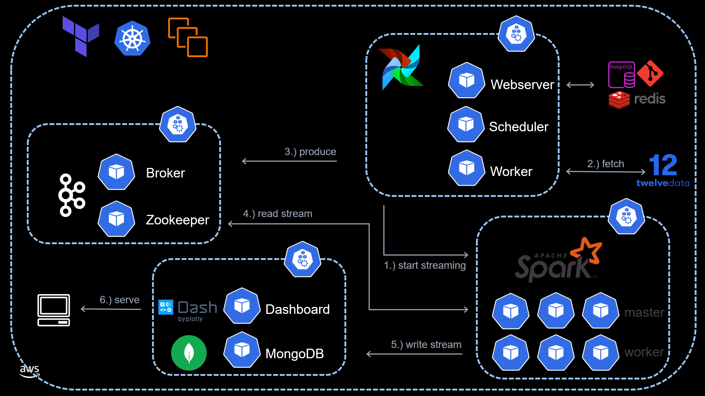
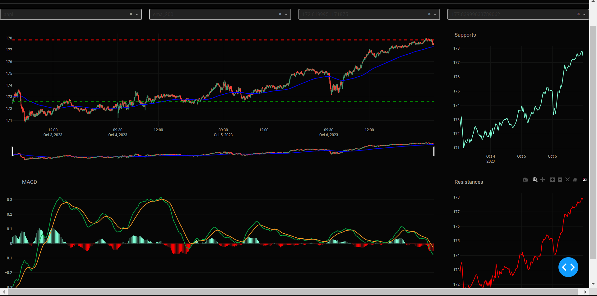
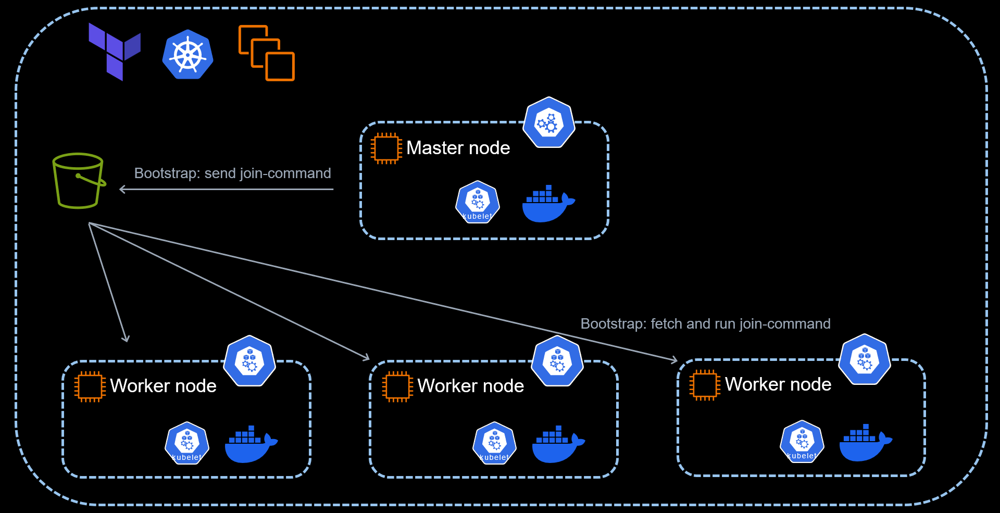
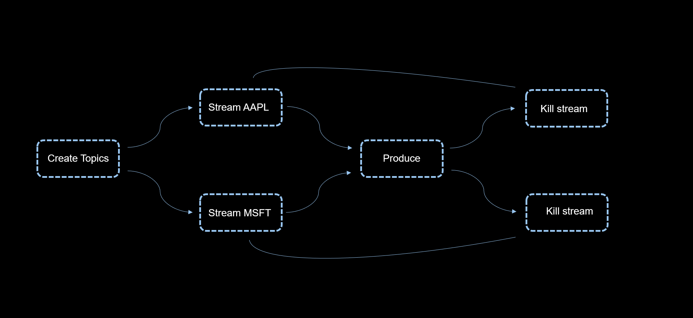

# Spark Streaming with K8s
This project uses Spark Scala to stream stock market data from Kafka to MongoDB. Analytics are then served via an interactive dashboard built with Plotly Dash. This application is cloud native, containerized with Docker, orchestrated with Kubernetes, and provisioned with Terraform. Additionally, the data streaming pipeline is (asynchronously) orchestrated with Airflow. A diagram showing a bird's eye view of the project is found below.

Technologies used in this project include:

- Terraform 
- AWS EC2
- Kubernetes
- Docker
- Airflow
- Kafka
- Spark (Scala)
- MongoDB
- Dash 

A screenshot showing a peak into the real-time Dash-app is shown below. 

## Folder Navigation 
- The __node-data__ folder contains files used when initializing master and worker nodes. Notably, the __master__ subfolder contains Kubernetes manifests which drive the project, as well as initialization scripts.  
- The __docker__ folder contains Dockerfiles used to create custom built images, which can be found at [dockerhub](https://hub.docker.com/repository/docker/peoplesjwilson/streaming-pipeline/general). The Kubernetes manifests found under __node-data/master__ pull these custom built images from dockerhub. 
- The __scala-app__ folder contains the Spark Scala code used to stream real time data from a kafka topic, transform the data, and load the result into a MongoDB collection. 
- The __dags__ folder contains the DAG used by airflow to start the process. The dagbag for the airflow kubernetes pods is synced with this folder. To sync with a personal repo, modify __node-data/master/airflow/values.yaml.tpl__ accordingly. 

## Kubernetes Cluster Creation with Terraform 
This project leverages Terraform in order to automatically create a Kubernetes cluster on EC2. While managed services such as EKS are the current standard, this project uses a more barebones approach. While it is occasionally beneficial to have access to the underlying instances of a cluster, the primary reason for this approach here was to gain a more fundamental understanding of Kubernetes. Here is a diagram describing the Kubernetes cluster creation. 

## A Closer Look at the DAG
A simplified version of the airflow DAG which drives the process is represented in the following diagram. 

The full version of the dag can be found in the __dags__ folder. Below is a brief description of some of the more interesting tasks.
- Tasks of the form __create_topic_symbol__ create a kafka topic for each symbol. This allows multiple streaming jobs to be decoupled.  

- Tasks of the form __start_streaming_from_symbol__ leverage the official python client library for Kubernetes to run a `spark_submit` command in the background of a spark-worker pod. This allows streaming jobs to be started from airflow asynchronously. The PID of the streaming job is returned, which allows for graceful shutdown of the streaming job later on.

    - While the __SparkSubmitOperator__ provided by airflow solves similar issues, I found use of the python client library for Kubernetes to be more straightforward and flexible. One advantage is the airflow pods do not need java or application jars installed in this setup. 

    - The streaming application which is started by this command listens to the Kafka topics created in the previous task, transforms the data, and loads the result into a MongoDB database.

- The __warmstart__ and __produce__ tasks simply fetch realtime stock market data using the [twelvedata](https://twelvedata.com) API. 

- Tasks of the form __stop_streaming_from_symbol__ again make use of the python client library for kuberntes to gracefully stop the streaming jobs. This uses the PID of the streaming job, which is captured in the __start_streaming_from_symbol__ task.  

## Automatic Scaling
This project automatically scales to stream data from any number of stock symbols, with two simple steps:
 - First, modify the list __symbols = ["AAPL","MSFT"]__ in __locals.tf__ to contain your symbols. 
 - Second, adjust the legnth of __spark = ["0","1"]__ to account for your new number of symbols. 

 Terraform will adjust environment variables so that Kafka topics for each symbol will be created. Additional kubernetes manifests will also be created, allowing a single-worker-spark-cluster pod to be spun up for each topic.  

 Of course, if you add many symbols, you will have to provision more worker-nodes in your kubernetes cluster. This can be accomplished by adding an entry to __worker_nodes = ["1","2","3","4","5","6","7","8"]__, found in __locals.tf__.

Currently, a Kubernetes manifest is generated to create a single worker spark cluster for each symbol. An alternative approach is to change only the number of worker nodes, and maintain a single spark cluster. This may be preferred, and can be accomplished with minor modifications to the terraform module __spark-templating__.  

## Reproducibility
### Setting Up the Kubernetes Cluster
- Step 0 to reproducing is to obtain your own API key from [twelvedata](https://twelvedata.com). Follow the instructions on their website to obtain your own API key. Then, clone this repo and replace __twelve_data_key__ in __locals.tf__ with your api key (as a string).
- Run `terraform init && terraform apply -auto-approve`
- Wait awhile for terraform to provision the resources, then ssh into the master-node by running `cd secrets && ./master-node-1.ssh`
- Run `kubectl get nodes` to check that everything is up and running.
    - You may have to wait a few more minutes before the server API is setup
### Initializing Pods
- After each provisioned node appears when running `kubectl get nodes`, you can create all the pods and services by running `cd master && chmod +x init-k8s.sh && ./init-k8s.sh`

- Now, your airflow server should be ready to view at port 8080 of your master node.
    - You can access the UI at {public_DNS}:8080, where public_DNS is the public DNS associated with your master-node. 
    - You can find the public DNS as a comment in the __master-node-1-ssh.sh__ file that we used to ssh into the master node. 
- Navigate to the airflow UI, and enter the credentials specified in __locals.tf__, which you can customize to your liking.
- Either wait for the streaming_pipeline dag to trigger at the next scheduled time, or manually trigger it. 
    - The dag will automatically trigger every weekday at 9:25am EST.
### Viewing the Dashboard
- After the "produce" task has begun for the first time, we can begin our dashboard app (it requires the database backend to be nonempty). 
    - From the master node, navigate to __~/master/dashboard__ and run `kubectl apply -f .`
    - Check the status of the pod with name __dash__ by inspecting the output of `kubectl get pods`
    - Once the pod is running, forward the dash service to port 8050 of the master node with `kubectl port-forward --address 0.0.0.0 svc/dash 8050:8050 &`. This command can also be found as a comment at the bottom of __init-k8s.sh__.
- Go to port 8050 of your master node to see the finished product!
### Cleanup 
- If you use the aws cli, run `aws s3 rb s3://{local.join_bucket_name} --force`. Alternatively, you can manually empty the bucket you created. 
- Run `terraform destroy`
## Customization and Scaling
- This project is built to scale, so feel free to add symbols to the list found in __locals.tf__. Just make sure the symbols you add are supported by [twelvedata](https://twelvedata.com/), and be sure to make the __spark__ list found in __locals.tf__ to count from 0 to the number of symbols (minus 1).

- If you add too many symbols, you may have to provision more aws nodes, which can be done easily by adding to the __worker_nodes__ list in __locals.tf__. 

- __n_samples__ in __locals.tf__ determines the number of minutes to stream realtime data from the twelvedata API. 
    - There are 390 minutes in a trading day :)

- Currently, the Kubernetes manifests found in node-data pull from a repo my personal dockerhub, which contains custom images. To make changes to the dashboard, or other aspects of this application, you can modify custom built docker images. Either pull from my dockerhub and modify locally, or change the Dockerfiles directly by navigating to the __docker__ folder in this repo. 

## Acknowledgements
This project contains software which falls under the Apache 2.0 license, which allows distribution, modifation, and distribution of modified versions of the software. Please see the license associated with this repo for more details.